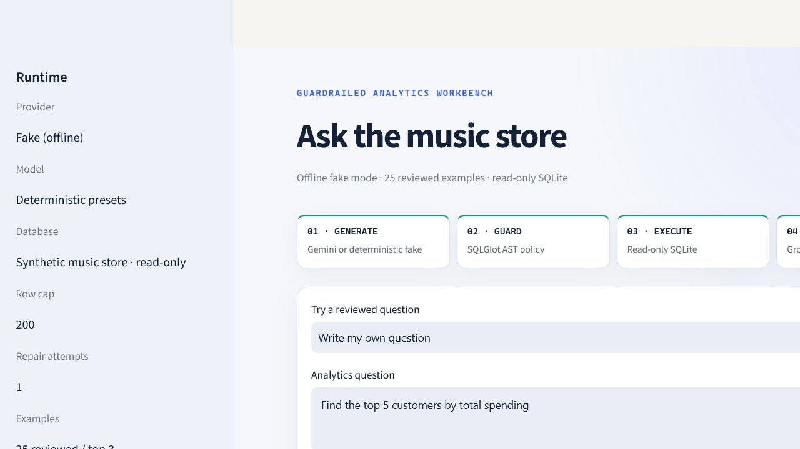
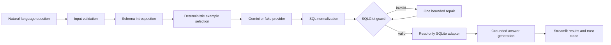

# Safe Text-to-SQL

A security-focused natural-language analytics workbench for a local music-store
database. It turns a question into SQL, validates the SQL with an AST policy, executes
it through a read-only SQLite connection, and produces a grounded answer.

The application runs entirely offline with a deterministic fake provider, or uses
Google Gemini for real language-model generation. No Azure service is required.



## Why this project exists

Text-to-SQL can make analytics accessible to non-SQL users, but executing
model-generated code creates a serious trust problem. This project treats the model as
untrusted: generated SQL must cross an application policy and a database-enforced
read-only boundary before it can run.

## Architecture



The provider, database, validation, and UI layers are independently testable. See
[the architecture guide](docs/architecture.md) for the component boundaries.

## Security model

- SQL is parsed as an AST; keyword matching is not the security boundary.
- Only one read-only `SELECT` or `WITH ... SELECT` statement is accepted.
- Referenced tables must be present in the introspected application schema.
- System catalogs, write operations, locking clauses, and data-modifying CTEs are
  rejected.
- A row limit is injected or clamped.
- SQLite is opened in read-only and query-only modes with a fail-closed authorizer.
- Credentials are runtime-only, masked in configuration representations, and excluded
  from Git and Docker build contexts.
- Logs use request IDs and safe categories without full prompts, rows, local paths, or
  provider secrets.

These controls reduce risk; they do not turn arbitrary LLM output into trusted code.
Read [SECURITY.md](SECURITY.md) and [docs/security.md](docs/security.md) before adapting
the project to sensitive data.

## Providers

`fake` is the default. It is deterministic, credential-free, and used by tests, CI,
screenshots, and the reproducible functional evaluation.

`gemini` uses the official Google Gen AI Python SDK behind the same asynchronous
provider protocol. It supports structured SQL generation, a bounded repair attempt,
grounded answer generation, request timeouts, bounded retries, and sanitized failures.

## Quick start: offline fake mode

Prerequisites: Python 3.11 or 3.12.

```bash
python -m venv .venv
source .venv/bin/activate
python -m pip install -r requirements.lock
python scripts/initialize_demo_db.py
streamlit run app.py
```

On Windows PowerShell, activate with `.venv\Scripts\Activate.ps1`. The app opens at
`http://localhost:8501`.

Try:

- `How many tracks are in the store?`
- `Which five artists have the most albums?`
- `Show total sales by country.`
- `What are the longest tracks?`

## Gemini setup

Copy `.env.example` to `.env`, then set:

```env
LLM_PROVIDER=gemini
GEMINI_API_KEY=your_gemini_api_key_here
GEMINI_MODEL=gemini-2.5-flash
```

Never commit `.env`. If Gemini mode is selected without a key, the UI returns a safe
configuration message and does not silently switch providers. Questions, generated
SQL, and bounded result context are sent to the selected provider; do not use Gemini
mode for data that your provider policy does not permit.

## Tests and quality gates

```bash
ruff check .
ruff format --check .
mypy src tests scripts app.py
pytest
python scripts/run_evaluation.py
python scripts/verify_release.py
```

All automated tests and the default evaluation are offline. Gemini tests mock the SDK
and never require a key or network access.

## Evaluation

`evaluation/cases.json` covers filters, aggregations, joins, grouping, ordering, nested
queries, CTEs, window functions, unsupported questions, prompt injection, and
destructive requests. Run:

```bash
python scripts/run_evaluation.py
```

The fake-provider result is a deterministic functional verification—not an LLM
accuracy score. Output is written to the ignored `evaluation/results/` directory. See
[docs/evaluation.md](docs/evaluation.md).

## Docker

```bash
docker compose up --build
```

The non-root container initializes the synthetic database during the image build and
starts in fake mode. Gemini can be enabled by injecting environment variables at
runtime; the image never contains `.env`. See [docs/docker.md](docs/docker.md).

## Deployment

The repository is prepared for Streamlit Community Cloud and any container platform
that supports a configurable `PORT`. Cloud deployment is not claimed by this
repository. See [docs/deployment.md](docs/deployment.md).

## Data provenance

The demo database is generated locally by `scripts/initialize_demo_db.py`. Its records
are fictional and authored for this portfolio project. It follows a compact
music-store analytical structure; it does not redistribute rows from the Chinook
sample database. The 25 reviewed question/SQL examples are stored in
`data/examples.json`.

## Limitations

- The lexical example selector is deterministic, not semantic vector retrieval.
- SQLite is the only implemented database adapter.
- Schema changes require regenerating or reviewing examples.
- The SQL policy is intentionally conservative and may reject valid advanced SQL.
- LLM output can still be wrong; users must review generated queries and results.
- The evaluation verifies known functional cases and does not establish production
  accuracy, latency, or safety guarantees.

## Roadmap

- Add an isolated PostgreSQL adapter with a dedicated read-only role.
- Add schema-aware evaluation for live provider runs.
- Add optional query-cost controls and audit persistence.
- Evaluate multilingual questions, including Arabic, with a reviewed benchmark.

## Project documentation

- [Local development](docs/local-development.md)
- [Architecture](docs/architecture.md)
- [Security controls](docs/security.md)
- [Evaluation methodology](docs/evaluation.md)
- [Docker](docs/docker.md)
- [Deployment](docs/deployment.md)
- [Contributing](CONTRIBUTING.md)

## License and author

Code and the authored synthetic demo data are available under the [MIT License](LICENSE).

Built by Abdallah Hosni.
