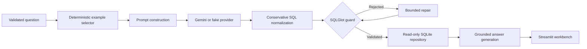

# Architecture

Safe Text-to-SQL is a guardrailed analytics workbench for a deterministic local
music-store database. The design keeps model access, SQL policy, database access,
and presentation behind separate interfaces so each trust boundary is testable
without a cloud credential.

## System flow

## Components

### Configuration

`Settings` reads environment variables only when instantiated. Secret values are
masked in representations, cloud credentials remain optional in fake mode, and the
database path is configured outside the user interface.

### Examples

The repository contains 25 normalized question-and-SQL examples migrated from the
approved legacy reference. A deterministic token-overlap selector supplies a small,
configurable set of relevant examples without an embedding API or semantic-retrieval
claim.

### Providers

Both providers implement the asynchronous `LLMProvider` protocol:

- `FakeLLMProvider` maps supported demo questions to deterministic SQL and answers for
  offline development, tests, evaluation, and CI.
- `GeminiLLMProvider` uses the official Google Gen AI SDK with runtime-only
  credentials, deterministic generation settings, request timeouts, bounded retries,
  structured outputs, and sanitized provider errors.

### SQL safety

Generated SQL is normalized and parsed with SQLGlot. The guard accepts exactly one
read-only query, enforces table access and row limits, and rejects mutations, system
catalogs, locking, and malformed SQL. Validation is fail-closed.

### Database

The default repository opens a deterministic synthetic SQLite database in read-only
mode. Initialization is a separate command. The repository exposes only schema
introspection and validated-query execution, enables SQLite query-only mode, checks
referenced tables, and returns capped, serializable rows.

### Orchestration

The application service owns the complete workflow and a single bounded repair loop.
It returns a structured success result or raises a safe categorized application error;
provider, SQL, and database internals do not leak into the UI.

### Presentation

Streamlit is a thin adapter over the application service. Its visual identity is a
focused query workbench: ink and cobalt typography, a cyan validation trace, compact
status indicators, and SQL/results as the primary analytical artifact. The sidebar
shows safe configuration summaries only.

## Trust boundaries

1. User text is untrusted and length-limited.
2. Example data is local, reviewed, and immutable at runtime.
3. Model output is untrusted until SQLGlot validation succeeds.
4. Only validated queries reach the database repository.
5. SQLite is opened read-only and placed in query-only mode.
6. Result rows are bounded before answer generation.
7. Provider prompts and complete rows are excluded from default logs.
8. `.env`, Streamlit secrets, runtime databases, and private migration evidence are
   excluded from Git and Docker build contexts.

## Data provenance

The demo database contains deterministic synthetic records created for this
repository. It follows a compact music-store schema compatible with the reviewed
examples but redistributes no legacy CSV rows and no Chinook database file.
